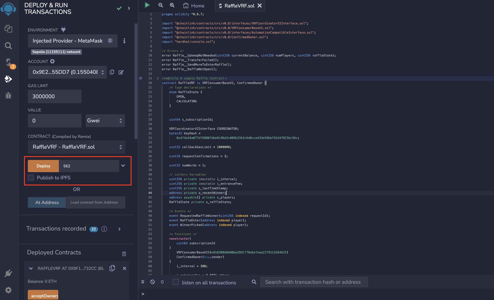

# Skoltech IBC 2023 Final Project: Decentralized Raffle System using Verifiable Random Function
Inspired by “Build a Raffle App With Solidity and NextJS: Code Along” *[Youtube](https://www.youtube.com/watch?v=gyMwXuJrbJQ&t=59647s)* video tutorial provided by Patrick Collins from Chainlink


# Getting Started

## Requirements

- [git](https://git-scm.com/book/en/v2/Getting-Started-Installing-Git)
  - You'll know you did it right if you can run `git --version` and you see a response like `git version x.x.x`
- [Nodejs](https://nodejs.org/en/)
  - You'll know you've installed nodejs right if you can run:
    - `node --version` and get an ouput like: `vx.x.x`
- [Yarn](https://yarnpkg.com/getting-started/install) instead of `npm`
  - You'll know you've installed yarn right if you can run:
    - `yarn --version` and get an output like: `x.x.x`
    - You might need to [install it with `npm`](https://classic.yarnpkg.com/lang/en/docs/install/) or `corepack`

## Quickstart

```
git clone https://github.com/suparatsrifa/IBC2023_Final_Project
cd IBC2023_Final_Project
yarn
yarn dev
```


# Usage

1. Deploy "RaffleVRF.sol" (e.g = Remix) with valid *[Chainlinnk Subscription ID](https://vrf.chain.link/)* input


2. Copy deployed contract address

3. Follow this [instruction from Chainlink's doc](https://docs.chain.link/vrf/v2/subscription/examples/get-a-random-number/) to add contract consumer

4. Top up "LINK" token to contract (the token can be requested from this [link](https://faucets.chain.link/))

3. Replace contract address in /components/RaffleEntrance.js


3. Run this code (use different terminal calling from this repo)

```
yarn dev
```

4. Go to UI [http://localhost:3000](http://localhost:3000)


## Presentation

You can view project's [presentation](https://docs.google.com/presentation/d/1wiWMIO8xM-1uU6GO1zW0oZwqOIBLel2IoIVwHK3jYQI/edit?usp=sharing) to follow the GUI tutorial

presentation materials
- RaffleVRF contract address: 0x9f1d26DE9aD49F261d2b6592e7397433F66732Cc
- RaffleVRF contract address link: [https://sepolia.etherscan.io/address/0x9f1d26de9ad49f261d2b6592e7397433f66732cc](https://sepolia.etherscan.io/address/0x9f1d26de9ad49f261d2b6592e7397433f66732cc)


## Members

- Waralak Pariwatphan, MSc-2 Data Science at Skoltech
- Sudarut Kasemsuk, MSc-2 Data Science at Skoltech 
- Suparat Srifa, MSc-2 Data Science at Skoltech


